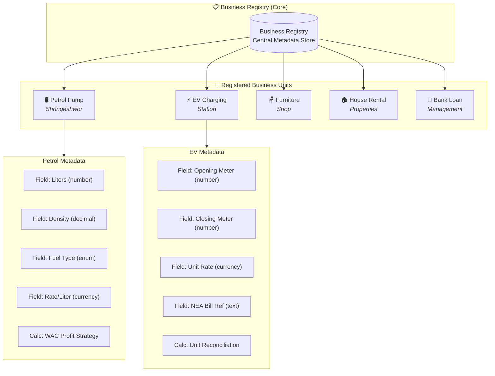
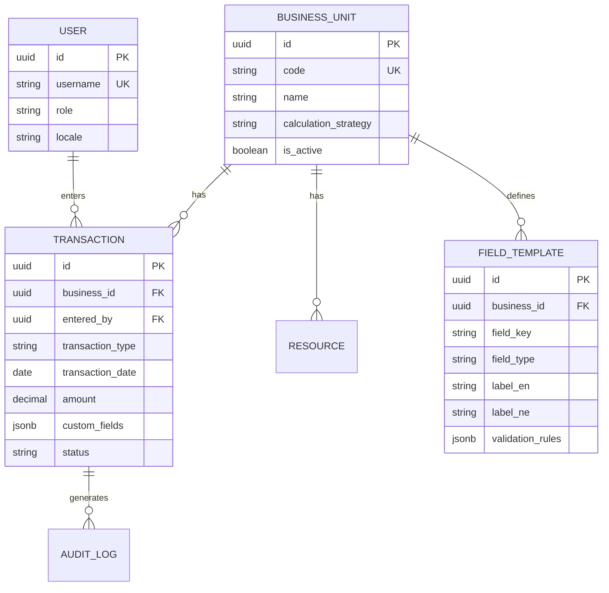
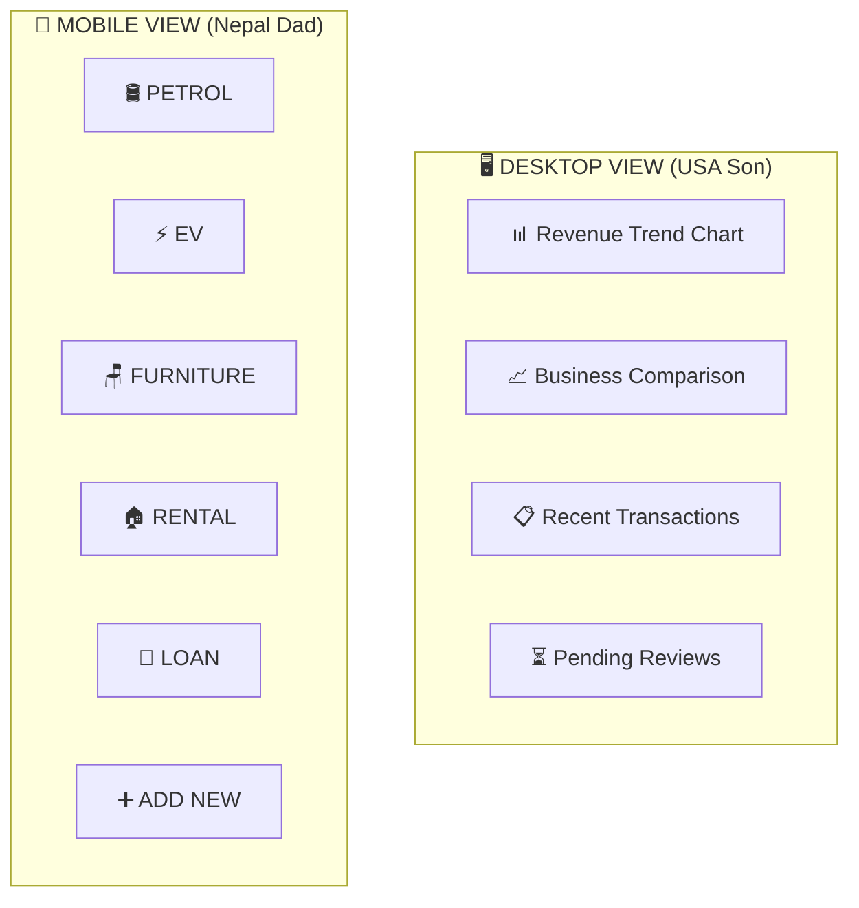
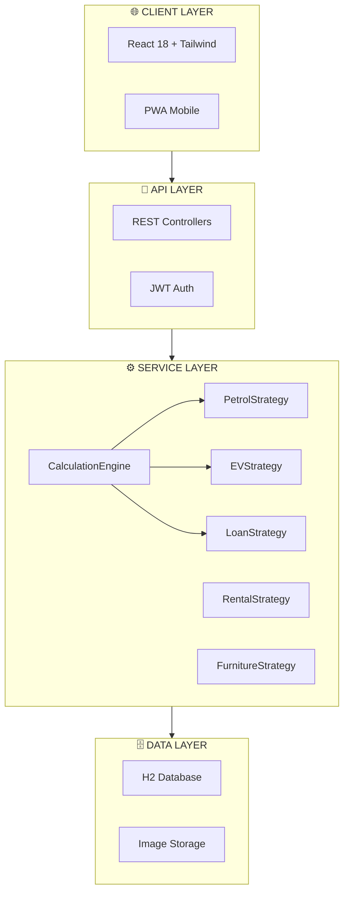

# 🏢 Samjhana Ventures OS - Complete System Architecture

## Overview

Samjhana Ventures OS is a dynamic multi-business ERP system designed for a Nepal-USA family business operation managing:

- 🛢️ **Shringeshwor Petrol Pump** - Fuel sales with WAC profit calculation
- ⚡ **EV Charging Station** - Meter-based billing with NEA reconciliation
- 🪑 **Furniture Shop** - Simple stock tracking (Items In - Items Out)
- 🏠 **House Rental** - Tenant and payment management
- 🏦 **Bank Loan Management** - Interest accrual and balance tracking

---

## Architecture Diagrams

### 1. Registry Pattern Architecture



[🎨 Edit Registry Diagram](https://mermaid.ai/live/edit)

---

### 2. Generic Data Schema (ERD)



---

### 3. Desktop vs Mobile Viewport



---

### 4. Layered Architecture with Strategy Pattern



---

## Project Structure

```
samjhana-ventures-os/
├── pom.xml                           # Maven build configuration
├── docs/
│   ├── ARCHITECTURE.md               # This document
│   └── DAD-PROOF-SETUP-GUIDE.md      # Setup guide for Dad
├── src/main/java/com/samjhana/
│   ├── SamjhanaVenturesOsApplication.java
│   ├── entity/
│   │   ├── BusinessUnit.java         # Business unit registry
│   │   ├── FieldTemplate.java        # Dynamic form fields
│   │   ├── Transaction.java          # Universal transaction
│   │   ├── Resource.java             # Employees, Products, Assets
│   │   ├── User.java                 # Dad/Son users
│   │   ├── AuditLog.java             # Change tracking
│   │   └── ImageAttachment.java      # Bill photos
│   └── service/strategy/
│       ├── BusinessCalculationStrategy.java
│       ├── CalculationEngine.java    # Strategy dispatcher
│       ├── PetrolStrategy.java       # WAC profit calculation
│       ├── EVStrategy.java           # Meter reconciliation
│       ├── LoanStrategy.java         # Interest accrual
│       ├── RentalStrategy.java       # Due calculation
│       └── FurnitureStrategy.java    # Stock tracking
├── src/main/resources/
│   └── application.yml               # Configuration
└── frontend/
    ├── package.json
    └── src/
        ├── components/
        │   ├── DynamicFormBuilder.jsx  # Template-driven forms
        │   └── QuickActionButtons.jsx  # Dad's home screen
        ├── i18n/
        │   └── index.js                # Nepali/English translations
        └── utils/
            └── formatters.js           # Lakhs/Crores formatting
```

---

## Key Features

### For Dad (Nepal)
- 📱 Large touch-friendly buttons (2x3 grid)
- 🇳🇵 Nepali language UI with Devanagari numerals
- 📸 Easy photo capture for invoices
- ⌨️ Big number keypad for data entry
- 💚 High contrast, elderly-friendly design

### For Son (USA)
- 📊 Comprehensive dashboards with charts
- ✅ Review and approve pending transactions
- 📈 Business comparison analytics
- 🔍 Audit trail and change history
- 🌐 Remote access via Tailscale VPN

---

## Business Logic Calculations

| Business | Formula |
|----------|---------|
| **Petrol** | Amount = Liters × Rate; Profit = (Sell Rate - WAC) × Liters |
| **EV** | Units = Closing Meter - Opening Meter; Amount = Units × Rate |
| **Loan** | Interest = (Principal × Rate × Days) / 36500 |
| **Rental** | Due = Months Overdue × Monthly Rent |
| **Furniture** | Stock = Initial + In - Out |

---

## Getting Started

### Build & Run
```bash
# Build the complete application (JAR with bundled frontend)
mvn clean package -Pprod

# Run the application
java -jar target/samjhana-ventures-os-1.0.0.jar

# Access at http://localhost:8080
```

### Development
```bash
# Backend only (skip frontend build)
mvn spring-boot:run -Pdev

# Frontend development
cd frontend
npm install
npm run dev
```

---

## Tailscale Setup for Remote Access

1. Install Tailscale on Dad's Nepal computer
2. Install Tailscale on Son's USA laptop
3. Both login with same account
4. Son accesses: `http://dads-pc.tailnet-xxx.ts.net:8080`

---

*Version 1.0.0 | January 2025*
