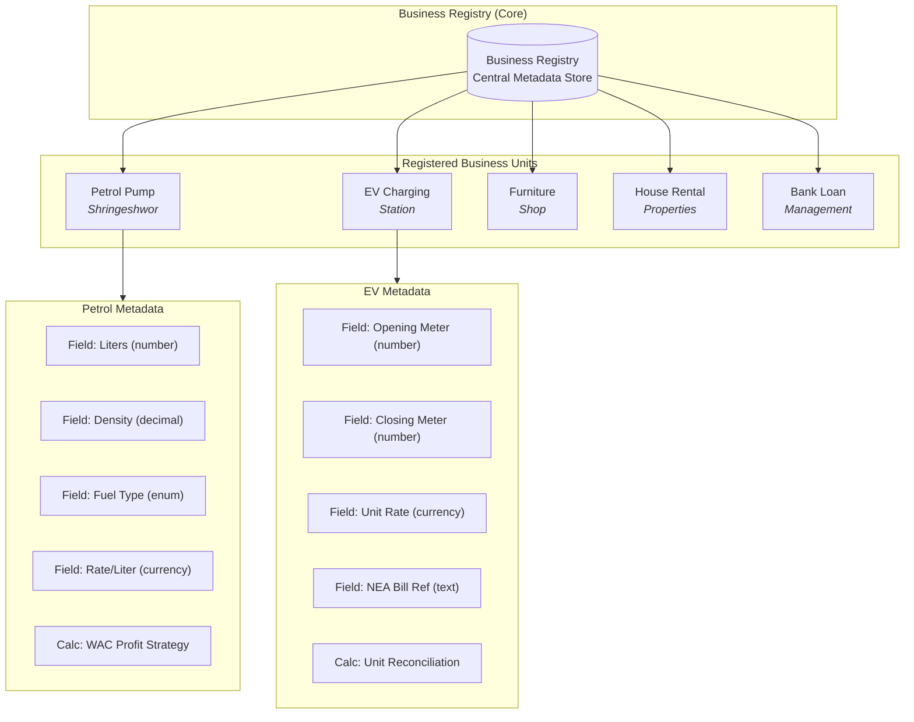
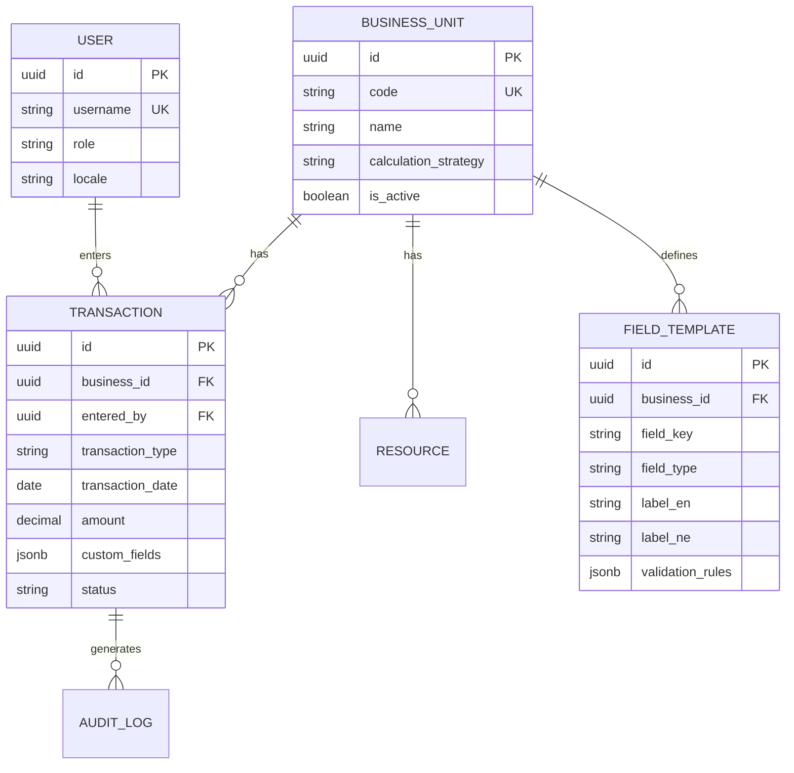
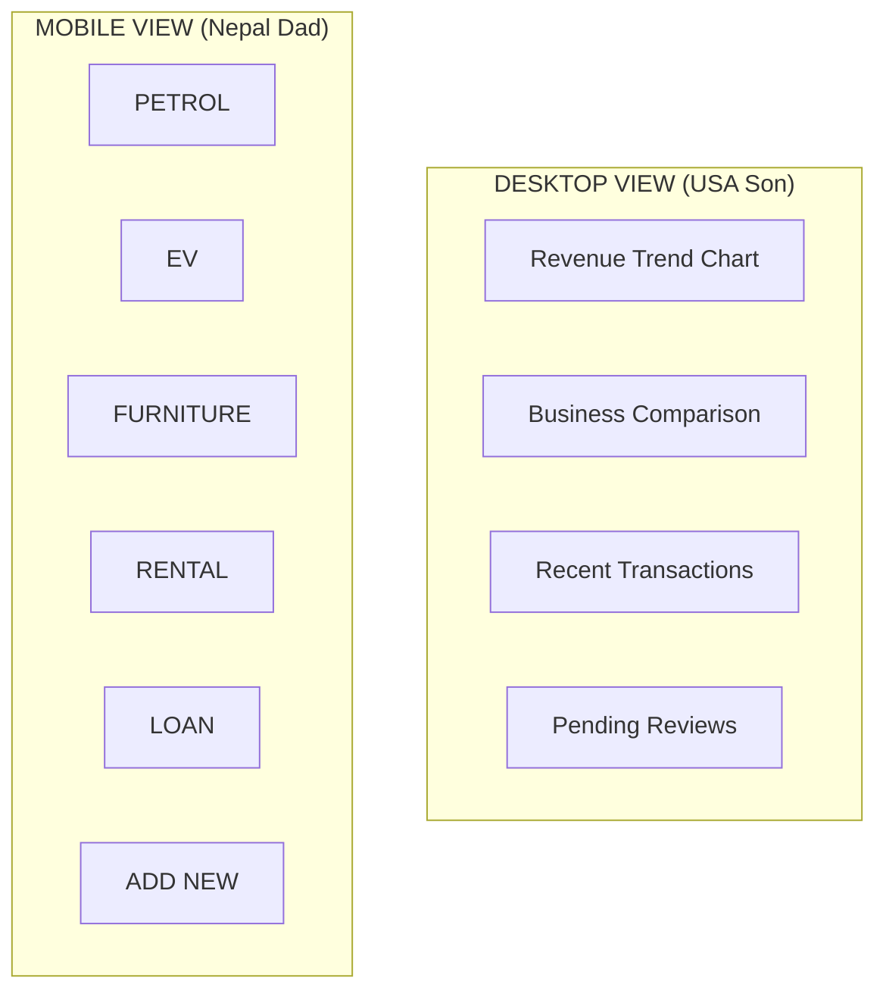
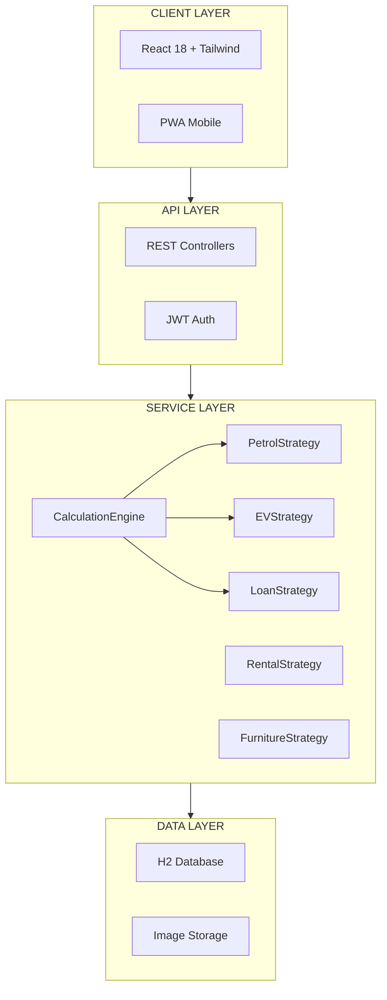

# Architecture

## System Overview

Samjhana Ventures OS uses a **registry-based architecture** where each business unit (petrol pump, EV charging, furniture, rental, loans) is registered with its own metadata, field templates, and calculation strategy. A central `CalculationEngine` dispatches to the correct strategy implementation based on the business unit code.

The backend is a Spring Boot 3.2.1 REST API with JWT authentication. The frontend is a React 18 SPA built with Vite, styled with Tailwind CSS, and uses Zustand for state management. Both layers communicate over REST, with the frontend proxying API calls in development.

---

## Architecture Diagrams

### 1. Registry Pattern



### 2. Entity Relationship Diagram



### 3. Desktop vs Mobile Viewport



### 4. Layered Architecture with Strategy Pattern



---

## Strategy Pattern

The `CalculationEngine` service dispatches calculations to the correct strategy based on the business unit's `calculationStrategy` field. Each strategy implements `BusinessCalculationStrategy`:

```
BusinessCalculationStrategy (interface)
├── PetrolStrategy       — WAC profit calculation
├── EVStrategy           — Meter reconciliation
├── LoanStrategy         — Interest accrual
├── RentalStrategy       — Due calculation
└── FurnitureStrategy    — Stock tracking
```

**Source**: `src/main/java/com/samjhana/strategy/`

---

## Business Logic Calculations

| Business | Formula |
|----------|---------|
| **Petrol** | Amount = Liters x Rate; Profit = (Sell Rate - WAC) x Liters |
| **EV** | Units = Closing Meter - Opening Meter; Amount = Units x Rate |
| **Loan** | Interest = (Principal x Rate x Days) / 36500 |
| **Rental** | Due = Months Overdue x Monthly Rent |
| **Furniture** | Stock = Initial + In - Out |

---

## Project Structure

```
samjhana-ventures-os/
├── pom.xml                                 # Maven build (dev + prod profiles)
├── .env.example                            # Environment variable template
├── docs/
│   ├── ARCHITECTURE.md                     # This document
│   ├── FEATURES.md                         # Feature documentation
│   └── DAD-PROOF-SETUP-GUIDE.md            # End-user setup guide
├── src/main/java/com/samjhana/
│   ├── SamjhanaVenturesOsApplication.java  # Entry point
│   ├── config/
│   │   ├── DataSeeder.java                 # Default data seeding
│   │   ├── SecurityConfig.java             # Spring Security + JWT config
│   │   └── WebConfig.java                  # CORS and web settings
│   ├── controller/
│   │   ├── AuthController.java             # Login / token endpoints
│   │   ├── AdminController.java            # User management
│   │   ├── TransactionController.java      # CRUD for all business transactions
│   │   ├── DailyReportController.java      # Daily close reports
│   │   ├── FuelPriceController.java        # Fuel price management + NOC scraper
│   │   ├── FurnitureController.java        # Furniture inventory + orders
│   │   ├── EvVehicleController.java        # EV vehicle rates
│   │   └── StaffController.java            # Staff CRUD
│   ├── dto/                                # Request/response DTOs (13 files)
│   ├── entity/                             # JPA entities (13 files)
│   │   ├── BusinessUnit.java               # Business unit registry
│   │   ├── Transaction.java                # Universal transaction
│   │   ├── FieldTemplate.java              # Dynamic form fields
│   │   ├── User.java                       # Authentication
│   │   ├── Staff.java                      # Employee records
│   │   ├── FuelPrice.java                  # Fuel price history
│   │   ├── EvVehicle.java                  # EV vehicle types + rates
│   │   ├── FurnitureItem.java              # Furniture inventory
│   │   ├── FurnitureCustomer.java          # Furniture customers
│   │   ├── DailyReport.java               # Daily close snapshots
│   │   ├── AuditLog.java                   # Change tracking
│   │   ├── Resource.java                   # Generic resources
│   │   └── ImageAttachment.java            # Bill/invoice photos
│   ├── repository/                         # Spring Data JPA repos (9 files)
│   ├── security/
│   │   ├── JwtAuthFilter.java              # JWT authentication filter
│   │   └── JwtUtil.java                    # Token generation/validation
│   ├── service/
│   │   ├── CalculationEngine.java          # Strategy dispatcher
│   │   ├── CustomUserDetailsService.java   # Spring Security user loader
│   │   └── NocPriceScraperService.java     # NOC fuel price scraper
│   └── strategy/
│       ├── BusinessCalculationStrategy.java # Strategy interface
│       └── impl/
│           ├── PetrolStrategy.java
│           ├── EVStrategy.java
│           ├── LoanStrategy.java
│           ├── RentalStrategy.java
│           └── FurnitureStrategy.java
├── src/main/resources/
│   └── application.yml                     # Config (profiles: dev, prod)
├── frontend/
│   ├── package.json
│   ├── vite.config.js                      # Dev server + API proxy
│   ├── tailwind.config.js
│   ├── index.html
│   └── src/
│       ├── main.jsx                        # React entry point
│       ├── App.jsx                         # Router + layout
│       ├── components/
│       │   ├── DatePicker.jsx              # Custom Nepali-friendly date picker
│       │   ├── DynamicFormBuilder.jsx       # Template-driven forms
│       │   ├── LanguageToggle.jsx           # EN/NE switcher
│       │   ├── QuickActionButtons.jsx       # Dad's home screen grid
│       │   └── SearchableSelect.jsx         # Filterable dropdown
│       ├── pages/                           # 24 page components
│       │   ├── LoginPage.jsx
│       │   ├── DashboardPage.jsx
│       │   ├── PetrolEntryPage.jsx
│       │   ├── EVEntryPage.jsx
│       │   ├── FuelOrderPage.jsx
│       │   ├── FuelPricePage.jsx
│       │   ├── EvVehiclePage.jsx
│       │   ├── FurnitureEntryPage.jsx
│       │   ├── FurnitureInventoryPage.jsx
│       │   ├── FurnitureCustomerPage.jsx
│       │   ├── FurnitureOrderPage.jsx
│       │   ├── FurnitureOrderHistoryPage.jsx
│       │   ├── FurnitureDashboardPage.jsx
│       │   ├── RentalEntryPage.jsx
│       │   ├── LoanEntryPage.jsx
│       │   ├── StaffManagementPage.jsx
│       │   ├── DailyClosePage.jsx
│       │   ├── ReportsPage.jsx
│       │   ├── RecordsPage.jsx
│       │   ├── PendingReviewPage.jsx
│       │   └── SettingsPage.jsx
│       ├── i18n/
│       │   └── index.js                    # English + Nepali translations
│       ├── utils/
│       │   ├── api.js                      # Axios instance + interceptors
│       │   └── formatters.js               # Lakhs/Crores + Devanagari numerals
│       └── test/
│           ├── setup.js                    # Vitest setup
│           └── test-utils.jsx              # Testing Library helpers
├── data/                                   # H2 database files (gitignored)
└── logs/                                   # Application logs (gitignored)
```
