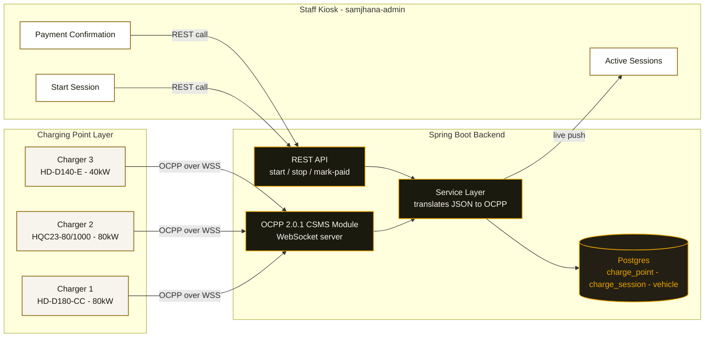
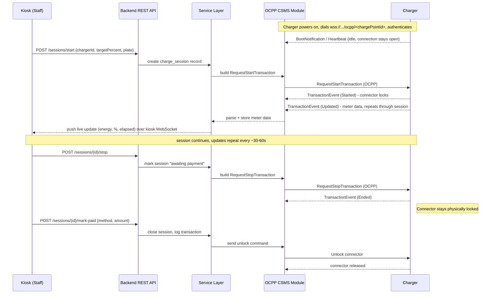

# EV Charging Remote Control — Architecture Design

**Status:** Proposed
**Author:** Minjoon (with Claude)
**Related:** EV Charging module (Samjhana Ventures OS)

## Context

Samjhana Ventures OS currently supports EV charging as manual back-office record-keeping only — staff enter meter readings and battery percentage after the fact. There is no real-time device control.

This document proposes adding remote start/stop control of the site's physical DC fast chargers, gated so a customer cannot disconnect until payment is confirmed.

## Constraints and decisions

- No customer-facing phone app. Not every customer can install one, so the system is staff/attendant-operated only, extending the existing samjhana-admin app.
- Customer identification is via a photo of the vehicle license plate, not a login/account.
- Payment is postpay-gated: the connector stays physically locked until staff confirms payment (cash, eSewa, or Khalti) at the counter, then the system sends the unlock.
- Chargers connect over wired Ethernet at the pump site (not WiFi/SIM) — most reliable, no data plan cost, independent of cellular signal. The charger initiates an outbound OCPP WebSocket connection; no inbound ports or port-forwarding needed at the site.
- Hardware: three Qingdao Hardhitter DC fast chargers (HD-D180-CC, HQC23-80/1000/260-Y02-CC, HD-D140-E), confirmed OCPP 2.0.1, RFID-capable. No vendor software/app layer exists — the CSMS, payment gating, and staff UI are being built entirely in-house.
- Backend hosting must be always-on (persistent WebSocket) — this is a hard prerequisite and conflicts with Render's free-tier spin-down. Resolving this (Koyeb / Fly.io) blocks the CSMS module going live.

## System components



## Connection layer: WebSocket URL and authentication

Each physical charger is configured (via its own local control panel or config tool — vendor-confirmed method still pending) to dial out to a URL of the form:

```
wss://<backend-host>/ocpp/<chargePointId>
```

Example, one per physical unit:

```
wss://api.samjhanaventures.com/ocpp/HD-D180-CC-01
wss://api.samjhanaventures.com/ocpp/HQC23-80-01
wss://api.samjhanaventures.com/ocpp/HD-D140-E-01
```

- `wss://` — WebSocket Secure (WebSocket over TLS). Never plain `ws://` in production; this is what stops anyone tapping the line from reading session data in transit.
- `<backend-host>` — the always-on Spring Boot backend. This is why the hosting decision above is a hard blocker: this host must be listening 24/7, not spun down between requests.
- `/ocpp/` — a routing path so OCPP traffic and normal REST API traffic can share the same backend without colliding.
- `<chargePointId>` — the unique identifier for that physical unit, matching the primary key of its `charge_point` row. This is how the backend knows which charger just connected.

**Authentication:** OCPP Security Profile 2 pairs the URL with HTTP Basic Auth in the WebSocket handshake — username is the charge point ID again, password is a per-station secret token generated and stored in the backend. This stops an unauthorized device from connecting to the CSMS and impersonating a charger. The charger also sends a `Sec-WebSocket-Protocol: ocpp2.0.1` header during the handshake to declare which OCPP version it speaks.

## Data model

- `charge_point` — one row per physical unit: charge point ID (matches the URL segment above), model, serial number, OCPP auth secret, live connection status
- `charge_session` — plate/vehicle link, charge_point + connector ID, target %, start time, live meter data, **final energy delivered (kWh)**, status (active / awaiting-payment / closed), payment method + amount
- `vehicle` — plate number, optional link to a repeat customer record
- `electricity_bill` — billing period start/end, total kWh billed by NEA, total amount paid (NPR); entered manually by staff per billing cycle, same pattern as other manual-entry screens in the app

## Full session flow, end to end



**Walking through it in order:**

1. **Power-on / idle.** Each charger, once configured with its CSMS URL and credentials, opens a persistent `wss://` connection to the backend the moment it's powered on — this connection stays open indefinitely, not just during a charge. While idle, the only traffic is occasional `Heartbeat` messages, basically a "still alive" ping. This is the OCPP WebSocket, hop one of two in the whole system.

2. **Staff starts a session.** An attendant on the kiosk picks a charger, photographs the plate, sets a target percentage, and hits Start. This fires a plain REST request (JSON) to the Spring Boot backend — nothing OCPP about this leg, it's just your own app's API.

3. **Backend creates the session record**, then the service layer translates that REST request into the OCPP-shaped command `RequestStartTransaction` and sends it down the already-open WebSocket to that specific charger, identified by its charge point ID.

4. **Charger starts delivering power and locks the connector.** It confirms via `TransactionEvent (Started)`, then begins sending `TransactionEvent (Updated)` messages periodically (energy delivered, and % if the unit supports SoC reporting) for as long as the session runs.

5. **Backend relays live data to the kiosk.** Every time a meter update arrives from the charger, the service layer stores it and immediately pushes it out over a second, separate WebSocket connection — backend to kiosk browser, hop two. This is what makes the Active Sessions board update live with no polling.

6. **Staff stops the session.** When the customer is done, staff hits Stop on the kiosk. That's another REST call, which the service layer translates into `RequestStopTransaction` and sends to the charger. The charger stops delivering power but — critically — the connector stays physically locked. The session moves to "awaiting payment" in the database.

7. **Customer pays at the counter.** Staff selects the payment method (cash / eSewa / Khalti) and confirms in the kiosk.

8. **Backend sends the unlock.** Only once payment is confirmed does the service layer send the unlock command down the OCPP connection, the charger releases the connector, and the session closes — its transaction record then flows into the same Reports / Daily Close pipeline as every other business unit.

Two WebSocket connections exist throughout this whole flow, each doing a different job: charger-to-backend (OCPP, the industry-standard protocol, JSON-only) and backend-to-kiosk (your own event push, so the dashboard updates instantly without asking).

## Confirmed hardware behavior

- **SoC reporting: confirmed.** `TransactionEvent` MeterValues does report State of Charge (%). "Stop at target %" is therefore **charger-enforced** — the backend watches incoming % updates and fires `RequestStopTransaction` once the staff-entered target is crossed, rather than estimating from Wh + an assumed battery capacity.
- **Physical Ethernet port: confirmed present** on the units.

## Open risk — connector lock default behavior

Still unconfirmed by the vendor, and it determines which of two session-state designs to build:

- **If unlock is automatic on `TransactionEvent (Ended)`** — the connector releases the moment charging stops, no separate command needed. This conflicts with the postpay-gating requirement (customer could unplug before paying), so the design would need to withhold `RequestStopTransaction` itself until payment is confirmed, rather than stopping power delivery and unlocking as two separate steps.
- **If unlock requires an explicit separate command** (the design the sequence diagram above assumes) — power stops on `RequestStopTransaction`, the lock stays engaged independently, and the backend controls unlock timing directly. This is the cleaner case and matches the flow as diagrammed.

This is a priority question to close out with the vendor, since it changes the state machine, not just a config value.

## Network configuration at the pump site

**Static IP vs DHCP (local network address for the charger):** Largely doesn't matter for this architecture. The charger only ever makes *outbound* connections to the backend — the backend never dials back into the charger's local IP — so DHCP is fine. A static local IP is only useful if you want to reach the charger's own local config page by a fixed address later; not required for OCPP to function.

**Firewall / outbound requirements:** Because the connection is outbound-only, no inbound ports need to be opened on the pump site's router — no port forwarding, no DMZ. What's needed:
- Outbound traffic allowed on port 443 (WSS) to the backend's domain — most routers allow this by default.
- Working DNS resolution on the local network, if the charger's CSMS URL field takes a domain name rather than a raw IP (worth confirming with the vendor which it accepts).

This is a direct consequence of the earlier decision to have the charger dial out rather than accept inbound connections — it's what keeps the pump-site network configuration close to zero-maintenance.

## Alignment with project principles

- Reliability over features: the CSMS module lives in the existing always-on backend rather than a new service, minimizing moving parts for a Nepal-based operator on a basic connection.
- Simplicity is a feature: no customer app, no vendor software dependency — one staff-operated flow, one backend.


## Energy accounting, NEA reconciliation, and profitability

This extends the existing "NEA Reconciliation" feature already present in the EV Charging module — previously reconciled against hand-typed meter readings, now against real per-session data captured automatically through OCPP.

**Per-session and per-charger energy data.** Since each `charge_session` stores the final energy delivered (kWh) once the session closes, summing these by `charge_point` and by date range gives real consumption per physical unit with no extra hardware — this data already exists as a byproduct of the OCPP flow, nothing new to build to capture it.

**The electricity bill.** NEA bills arrive as a physical document, not something the system can fetch automatically. Staff enter it once per billing cycle into the new `electricity_bill` record: billing period, total kWh billed, total amount paid.

**Reconciliation.** For a given billing period, two numbers are compared:
- **Sold kWh** — sum of `energy_delivered` across all closed sessions at the site for that period
- **Billed kWh** — the NEA bill's total for the same period

The gap between them is not noise — it reflects line loss, charger standby draw while idle, or a metering discrepancy worth investigating if it grows large over time.

**Profit calculation**, following the same pattern already used for WAC profit in the Petrol Pump module:
- Revenue = sum of `amount` collected from paid customer sessions in the period
- Cost = the NEA bill's total amount for the same period
- Profit % = (Revenue − Cost) / Revenue x 100

**Open question:** whether the pump site has one shared NEA meter across all three chargers, or separate meters per unit. If shared (the likely case), profit is calculated at the site level; per-charger usage can still be reported from session data, but per-charger cost can only be estimated by proportional split, not billed directly, unless NEA meters and bills each unit separately.
